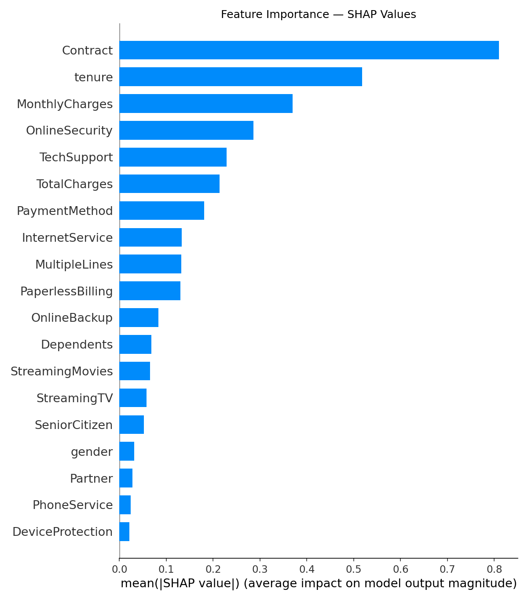
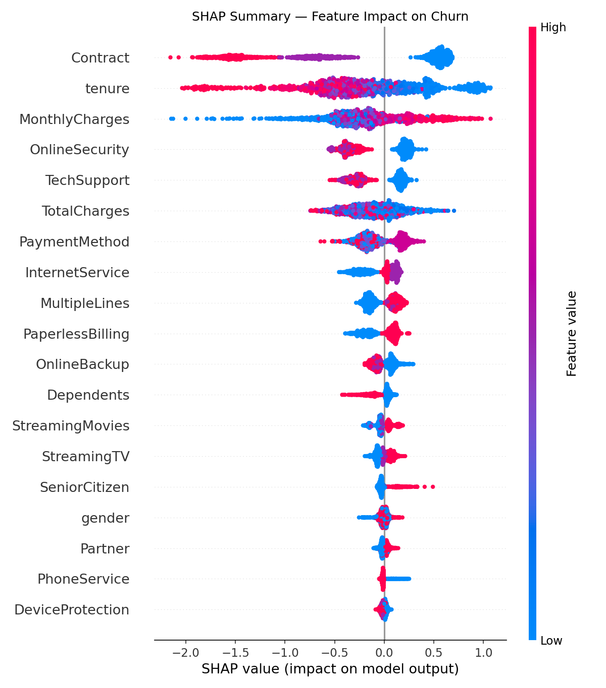
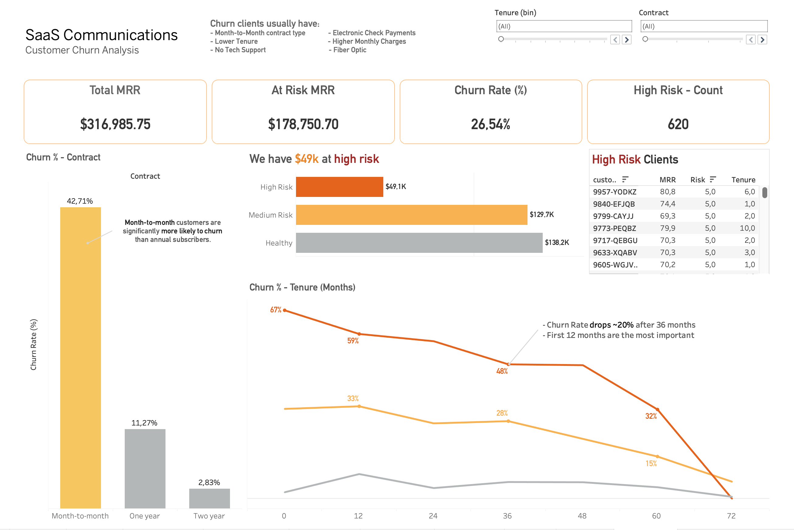

# Customer Churn Analysis — SaaS Communications

End-to-end churn analysis project simulating a SaaS communications company. The goal: identify customers at risk of cancellation, quantify the revenue impact, and recommend data-driven retention actions.

---

## Business objective

Reduce monthly churn by 15% through proactive identification of at-risk customers, prioritizing retention efforts by revenue impact (MRR).

**Key numbers:**

| Metric | Value |
|---|---|
| Total MRR | $316,985.75 |
| MRR at risk (Medium + High Risk) | $178,750.70 |
| Overall churn rate | 26.54% |
| High Risk customers (active) | 620 |
| Model AUC-ROC | 0.84 |
| Estimated annual savings (30% retention) | $642k/year |

---

## Dataset

IBM Telco Customer Churn dataset (7,043 customers, 26 features), reframed under a SaaS Communications business context. Includes subscription details, billing information, service usage, and customer demographics.

> The dataset is publicly available and was originally built for churn prediction benchmarking. Business framing, segmentation logic, and all derived metrics in this project are original work.

---

## Methodology

1. **Data ingestion & cleaning** — schema validation, missing value treatment, type casting
2. **Feature engineering** — churn target definition, risk scoring logic
3. **Exploratory data analysis** — churn drivers identified via segmented comparison (Contract, Tenure, TechSupport, PaymentMethod, InternetService)
4. **Risk segmentation** — customers classified into Healthy / Medium Risk / High Risk based on the top churn drivers
5. **Predictive modeling** — XGBoost classifier with SHAP interpretability analysis
6. **Dashboard & reporting** — interactive Tableau dashboard + 5-slide executive deck

---

## Key insights

- **Contract type is the strongest churn driver.** Month-to-month customers churn at 42.7%, vs. 11.3% for annual and 2.8% for two-year contracts — a 15x difference between the best and worst segment.
- **The first 12 months are critical.** Churn rate starts at 67% in the first month and drops to 32% only after 36 months of tenure.
- **Lack of Tech Support and Online Security acts as a churn amplifier** — customers without these services churn at roughly 3x the rate of those with them.
- **Payment friction correlates with retention.** Electronic check users churn at 45.3%, compared to ~16% for customers on automatic payment methods.
- **The XGBoost model identifies 77% of churners before cancellation** (Recall), with an AUC-ROC of 0.84 — confirming Contract, Tenure, and MonthlyCharges as the top predictive features via SHAP analysis.

---

## Results

### Machine learning model

### Interactive dashboard

**[→ Explore the live dashboard on Tableau Public](https://public.tableau.com/app/profile/breno.zamponi/viz/Telecom_Project_17818062247250/Dashboard1)**

### Executive presentation

**[→ View the 5-slide executive deck on Google Slides](https://docs.google.com/presentation/d/1M74fd_PI9YJnBa5bb1z-oeDz8704pR7FUK652qnr0nc/edit?usp=sharing)**

---

## Recommendations

| Priority | Action | Target | Expected impact |
|---|---|---|---|
| 1 | Direct 1:1 CS outreach | 620 High Risk customers | $49.1K MRR protected |
| 2 | Automated retention email campaign | 1,933 Medium Risk customers | $129.7K MRR mitigated |
| 3 | Structural changes: annual contract incentives, 90-day onboarding program, free Tech Support trial | Entire customer base | Long-term churn rate reduction |

---

## Project management

This project was planned and tracked using Jira with Scrum methodology — 4 epics, 16 user stories, 3 sprints, and defined acceptance criteria for each deliverable.

---

## Tech stack

`Python` · `Pandas` · `Scikit-learn` · `XGBoost` · `SHAP` · `Matplotlib` · `Seaborn` · `Tableau Public` · `Jira`

---

Run the notebooks in order: `01_ingestao.ipynb` → `02_mrr.ipynb` → `03_model.ipynb`

---

## Author

**Breno Zamponi**
Junior Data Analyst | BSc Data Science (in progress) — Unopar

[LinkedIn](https://www.linkedin.com/in/breno-zamponi-b3bb2a2aa/) 

